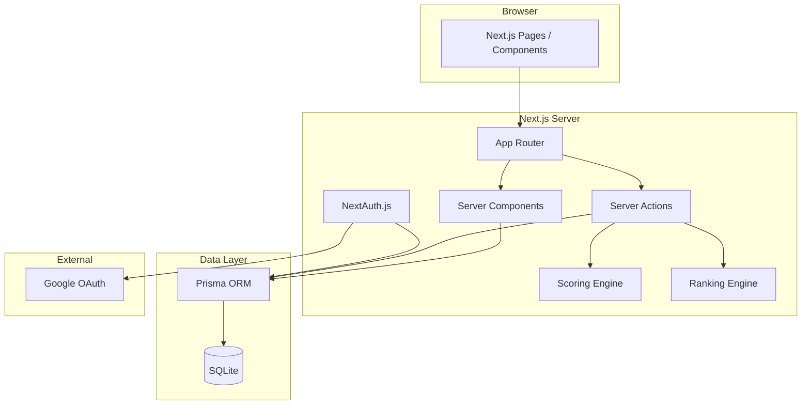
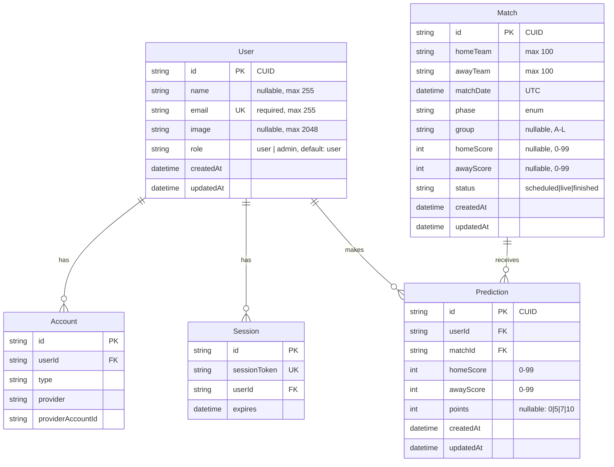
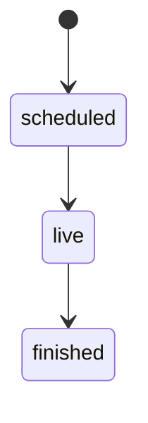

# Design Document

## Overview

This design covers the foundational setup of the Bolão Copa do Mundo 2026 system — a full-stack Next.js application that lets authenticated users submit score predictions for World Cup matches and compete in an automatic ranking system.

The system is built as a monolith using Next.js 14+ App Router with TypeScript strict mode, Prisma ORM with SQLite, NextAuth.js for Google OAuth authentication, Tailwind CSS for styling, Zod for runtime validation, and Vitest for testing.

Key capabilities delivered by this foundation:
- Project scaffolding with all dependencies configured
- Google OAuth authentication with session management
- Database schema for Users, Matches, and Predictions
- Prediction submission with deadline enforcement
- Scoring engine that calculates points based on prediction accuracy
- Overall and phase-based ranking calculation

## Architecture

### System Architecture



### Request Flow

1. **Authentication**: User clicks login → NextAuth redirects to Google → callback creates/updates User → session established
2. **Prediction Submission**: User submits prediction via Server Action → validates deadline + scores with Zod → upserts Prediction record
3. **Scoring**: Admin registers result → Server Action updates Match → Scoring Engine calculates points for all related Predictions
4. **Ranking**: Ranking Engine sums points, applies tiebreakers, returns ordered list

### Key Design Decisions

| Decision | Choice | Rationale |
|----------|--------|-----------|
| Database | SQLite via Prisma | Simple deployment, sufficient for small-to-medium user groups, no separate DB process |
| Auth | NextAuth.js + Google | Zero-password UX, familiar to users, well-integrated with Next.js |
| Mutations | Server Actions | Type-safe, colocated with UI, no API route boilerplate |
| Validation | Zod schemas | Runtime + TypeScript inference, composable, used by both client and server |
| Scoring | Synchronous in Server Action | Small dataset (max ~100 users × 64 matches), no need for background jobs |

## Components and Interfaces

### Module Structure

```
src/
├── app/
│   ├── layout.tsx              # Root layout with session provider
│   ├── page.tsx                # Home/ranking page
│   ├── login/page.tsx          # Login page
│   └── api/auth/[...nextauth]/route.ts  # NextAuth API route
├── components/
│   ├── AuthButton.tsx          # Login/logout button
│   ├── SessionProvider.tsx     # Client-side session wrapper
│   └── ui/                     # Shared UI primitives
├── lib/
│   ├── auth.ts                 # NextAuth config & helpers
│   ├── prisma.ts               # Prisma client singleton
│   ├── scoring.ts              # Scoring engine (pure functions)
│   ├── ranking.ts              # Ranking calculation (pure functions)
│   └── validations.ts          # Zod schemas
├── server/
│   ├── actions/
│   │   ├── predictions.ts      # Prediction CRUD actions
│   │   └── matches.ts          # Match management actions (admin)
│   └── queries/
│       ├── matches.ts          # Match queries
│       ├── predictions.ts      # Prediction queries
│       └── ranking.ts          # Ranking queries
prisma/
└── schema.prisma               # Database schema
```

### Key Interfaces

#### Scoring Engine (`src/lib/scoring.ts`)

```typescript
type ScoringTier = 0 | 5 | 7 | 10;

interface ScoreInput {
  predictionHome: number;
  predictionAway: number;
  actualHome: number;
  actualAway: number;
}

function calculatePoints(input: ScoreInput): ScoringTier;
```

#### Ranking Engine (`src/lib/ranking.ts`)

```typescript
interface RankedUser {
  position: number;
  userId: string;
  name: string;
  totalScore: number;
  exactPredictions: number;
}

interface PhaseRankedUser {
  position: number;
  userId: string;
  name: string;
  phaseScore: number;
  exactPredictions: number;
}

function calculateRanking(predictions: ScoredPrediction[]): RankedUser[];
function calculatePhaseRanking(predictions: ScoredPrediction[], phase: Phase): PhaseRankedUser[];
```

#### Prediction Validation (`src/lib/validations.ts`)

```typescript
import { z } from "zod";

const predictionSchema = z.object({
  matchId: z.string().cuid(),
  homeScore: z.number().int().min(0).max(99),
  awayScore: z.number().int().min(0).max(99),
});

const matchResultSchema = z.object({
  matchId: z.string().cuid(),
  homeScore: z.number().int().min(0).max(99),
  awayScore: z.number().int().min(0).max(99),
});
```

#### Server Actions (`src/server/actions/predictions.ts`)

```typescript
async function submitPrediction(data: PredictionInput): Promise<ActionResult>;
async function registerMatchResult(data: MatchResultInput): Promise<ActionResult>;
```

## Data Models

### Prisma Schema



### Schema Details

```prisma
model User {
  id            String    @id @default(cuid())
  name          String?   @db.VarChar(255)
  email         String    @unique @db.VarChar(255)
  image         String?
  role          String    @default("user") // "user" | "admin"
  createdAt     DateTime  @default(now())
  updatedAt     DateTime  @updatedAt
  accounts      Account[]
  sessions      Session[]
  predictions   Prediction[]
}

model Match {
  id          String    @id @default(cuid())
  homeTeam    String
  awayTeam    String
  matchDate   DateTime
  phase       String    // group_stage, round_of_32, etc.
  group       String?   // A-L, only for group_stage
  homeScore   Int?
  awayScore   Int?
  status      String    @default("scheduled") // scheduled, live, finished
  createdAt   DateTime  @default(now())
  updatedAt   DateTime  @updatedAt
  predictions Prediction[]

  @@unique([homeTeam, awayTeam, matchDate])
}

model Prediction {
  id        String   @id @default(cuid())
  userId    String
  matchId   String
  homeScore Int
  awayScore Int
  points    Int?
  createdAt DateTime @default(now())
  updatedAt DateTime @updatedAt
  user      User     @relation(fields: [userId], references: [id], onDelete: Cascade)
  match     Match    @relation(fields: [matchId], references: [id], onDelete: Cascade)

  @@unique([userId, matchId])
}
```

### Status Transition Rules



- `scheduled`: Scores are null. Predictions can be submitted/updated.
- `live`: Scores may be updated (real-time). Predictions are locked.
- `finished`: Scores are required. Scoring engine runs.

## Correctness Properties

*A property is a characteristic or behavior that should hold true across all valid executions of a system—essentially, a formal statement about what the system should do. Properties serve as the bridge between human-readable specifications and machine-verifiable correctness guarantees.*

### Property 1: Match score-status invariant

*For any* Match record, if the status is "scheduled" then homeScore and awayScore must both be null; if the status is "live" then homeScore and awayScore must each be null or an integer in [0, 99]; if the status is "finished" then homeScore and awayScore must both be non-null integers in [0, 99].

**Validates: Requirements 4.2, 4.3, 4.4**

### Property 2: Match status transition validity

*For any* pair of status values (fromStatus, toStatus), the system shall accept the transition if and only if the pair is ("scheduled", "live") or ("live", "finished"). All other transitions shall be rejected.

**Validates: Requirements 4.5**

### Property 3: Prediction deadline enforcement

*For any* prediction submission with a submission timestamp and associated match with a matchDate, the system shall accept the prediction if and only if the submission timestamp is strictly before the matchDate. Submissions at or after matchDate shall be rejected.

**Validates: Requirements 6.1, 6.2**

### Property 4: Prediction upsert before deadline

*For any* user who already has a prediction for a match, submitting a new prediction before the matchDate shall update the existing record's homeScore and awayScore to the new values, and the userId+matchId combination shall remain unique (no duplicate created).

**Validates: Requirements 6.3**

### Property 5: Prediction score validation

*For any* value submitted as homeScore or awayScore, the system shall accept it if and only if it is an integer in the range [0, 99]. Non-integer values, negative values, and values greater than 99 shall be rejected.

**Validates: Requirements 6.4, 6.5**

### Property 6: Scoring tier correctness and mutual exclusivity

*For any* prediction (pH, pA) and actual result (aH, aA) where both are non-negative integers, exactly one of the following tiers applies:
- 10 points: pH == aH AND pA == aA (exact match)
- 7 points: pH != aH OR pA != aA, AND sign(pH - pA) == sign(aH - aA), AND (pH - pA) == (aH - aA) (correct winner + goal difference)
- 5 points: sign(pH - pA) == sign(aH - aA) AND (pH - pA) != (aH - aA) (correct winner/draw, wrong goal difference)
- 0 points: sign(pH - pA) != sign(aH - aA) (wrong outcome)

The tiers are mutually exclusive and exhaustive — every valid input maps to exactly one tier.

**Validates: Requirements 7.2, 7.3, 7.4, 7.5, 7.6, 7.7**

### Property 7: Total score is sum of scored predictions

*For any* user with a set of scored predictions, the user's total score in the ranking shall equal the arithmetic sum of the points field from all their predictions where points is not null.

**Validates: Requirements 8.1**

### Property 8: Overall ranking order

*For any* set of users with scores, the ranking shall be ordered such that:
1. Users with higher total scores appear before users with lower total scores
2. Among users with equal total scores, those with more exact-score predictions (10-point) appear first
3. Among users still tied, the one whose earliest exact-score prediction has an earlier timestamp appears first
4. Users with zero scored predictions appear below all users who have at least one scored prediction

**Validates: Requirements 8.2, 8.3, 8.5**

### Property 9: Phase ranking scoping

*For any* phase and set of predictions, the phase ranking shall include only users who have at least one prediction for a match in that phase, and each user's phase score shall equal the sum of points only from predictions for matches belonging to that phase.

**Validates: Requirements 9.1, 9.7**

### Property 10: Phase ranking display condition

*For any* phase, a phase ranking shall be displayed if and only if the phase has at least one match with status "finished".

**Validates: Requirements 9.2, 9.8**

### Property 11: Phase ranking finalization

*For any* phase, the phase ranking shall be marked as final if and only if all matches in that phase have status "finished" and their predictions have been scored.

**Validates: Requirements 9.3**

### Property 12: Phase ranking order

*For any* phase ranking, users shall be ordered by:
1. Phase points descending
2. Number of exact-score predictions within that phase descending (first tiebreaker)
3. Alphabetical order of user display name ascending (second tiebreaker)

**Validates: Requirements 9.4**

## Error Handling

### Authentication Errors

| Error Scenario | Handling |
|----------------|----------|
| Google OAuth failure | Display error message, redirect to login page |
| Session expired | Treat as unauthenticated, redirect to login with callback URL |
| Invalid session token | Clear session, redirect to login |

### Prediction Errors

| Error Scenario | Response |
|----------------|----------|
| Deadline passed | `{ error: "O prazo para palpites deste jogo já encerrou" }` |
| Invalid score value | `{ error: "Placar inválido", details: { field, message: "Valor deve ser entre 0 e 99" } }` |
| Match not found | `{ error: "Jogo não encontrado" }` |
| Unauthorized | Redirect to login |

### Scoring Errors

| Error Scenario | Handling |
|----------------|----------|
| Scoring fails for some predictions | Preserve existing points, report affected predictions to admin |
| Match result invalid | Reject with validation error before triggering scoring |
| Database error during scoring | Transaction rollback, preserve previous state |

### Match Management Errors

| Error Scenario | Response |
|----------------|----------|
| Invalid status transition | `{ error: "Transição de status inválida", details: { from, to } }` |
| Missing scores for "finished" | `{ error: "Placar obrigatório para finalizar jogo" }` |
| Duplicate match | `{ error: "Jogo duplicado (mesmo time mandante, visitante e data)" }` |

### General Error Format

All server action errors follow the convention:
```typescript
type ActionResult<T = void> =
  | { success: true; data?: T }
  | { success: false; error: string; details?: Record<string, string> };
```

## Testing Strategy

### Test Framework

- **Vitest** for all tests (unit, property-based, integration)
- **fast-check** for property-based testing (best TypeScript PBT library)
- Minimum **100 iterations** per property test

### Test Structure

```
src/
├── lib/
│   ├── __tests__/
│   │   ├── scoring.test.ts          # Unit + property tests for scoring
│   │   ├── scoring.property.test.ts # Property-based tests for scoring
│   │   ├── ranking.test.ts          # Unit + property tests for ranking
│   │   ├── ranking.property.test.ts # Property-based tests for ranking
│   │   └── validations.test.ts      # Validation schema tests
│   └── ...
├── server/
│   ├── actions/__tests__/
│   │   ├── predictions.test.ts      # Prediction action tests
│   │   └── matches.test.ts          # Match management tests
│   └── ...
```

### Property-Based Tests

Each correctness property maps to a dedicated property-based test using `fast-check`:

| Property | Test File | Key Generators |
|----------|-----------|----------------|
| P1: Score-status invariant | `scoring.property.test.ts` | `arbitraryMatch()` with status/score constraints |
| P2: Status transitions | `scoring.property.test.ts` | `fc.constantFrom("scheduled","live","finished")` pairs |
| P3: Deadline enforcement | `predictions.property.test.ts` | `arbitraryTimestamp()` relative to `matchDate` |
| P4: Prediction upsert | `predictions.property.test.ts` | `arbitraryPrediction()` with existing records |
| P5: Score validation | `validations.property.test.ts` | `fc.integer()`, `fc.double()`, `fc.string()` |
| P6: Scoring tiers | `scoring.property.test.ts` | `fc.integer({min:0, max:99})` for all four scores |
| P7: Total score sum | `ranking.property.test.ts` | `fc.array(arbitraryScoredPrediction())` |
| P8: Overall ranking order | `ranking.property.test.ts` | `fc.array(arbitraryUserWithScore())` |
| P9: Phase scoping | `ranking.property.test.ts` | `arbitraryPredictionsAcrossPhases()` |
| P10: Phase display condition | `ranking.property.test.ts` | `arbitraryPhaseWithMatches()` |
| P11: Phase finalization | `ranking.property.test.ts` | `arbitraryPhaseWithMatches()` |
| P12: Phase ranking order | `ranking.property.test.ts` | `fc.array(arbitraryPhaseUserScore())` |

**Configuration:**
- Each property test runs with `{ numRuns: 100 }` minimum
- Each test includes a comment tag: `// Feature: bolao-copa-setup, Property N: <description>`

### Unit Tests (Example-Based)

| Area | Key Examples |
|------|-------------|
| Auth | Login redirect, callback success, callback error, session content, logout |
| Schema | User uniqueness, default role, cascade deletes, nullable fields |
| Match | Duplicate rejection, unique constraint on homeTeam+awayTeam+matchDate |
| Prediction | Duplicate rejection, preserve existing on constraint violation |
| Scoring failure | Preserve previous points on partial failure |

### Integration Tests

| Area | Scenario |
|------|----------|
| Auth flow | Full OAuth callback → session creation → protected route access |
| Scoring pipeline | Register result → scoring runs → ranking updates |
| Cascade deletes | Delete user → predictions removed; Delete match → predictions removed |

### Test Dependencies

```json
{
  "devDependencies": {
    "vitest": "^1.x",
    "fast-check": "^3.x",
    "@testing-library/react": "^14.x"
  }
}

